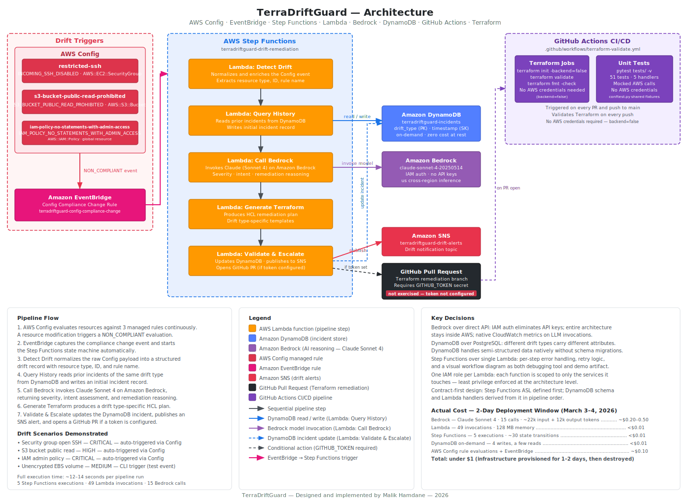

# TerraDriftGuard

An agentic SRE system that:
- detects AWS infrastructure drift
- reasons about it using an LLM
- generates Terraform remediation plans — fully serverless, fully inside AWS.


## 1. What It Does

When a resource is modified outside of Terraform (e.g., a security group rule added manually in the AWS Console or preferably via the CLI), TerraDriftGuard:
1. **Detects** the drift via AWS Config and EventBridge
2. **Queries** incident history in DynamoDB to check whether this type of drift has occurred before and what was done last time
3. **Reasons** about the change using Claude on Amazon Bedrock — is it intentional? Is it dangerous? What should the remediation look like?
4. **Generates** a Terraform plan that reverts or corrects the drift
5. **Validates** the generated Terraform via `terraform validate` and `terraform plan`
6. **Escalates** by opening a pull request on GitHub with the proposed fix, or applies it automatically if the confidence threshold is met

The entire lifecycle is orchestrated by AWS Step Functions, with each step handled by a dedicated Lambda function.


## 2. Architecture

```
AWS Config Rule
    → EventBridge
        → Step Functions Workflow
            → Lambda: Detect Drift
            → Lambda: Query DynamoDB History
            → Lambda: Call Bedrock (Claude)
            → Lambda: Generate Terraform
            → Lambda: Validate & Escalate
                → GitHub Pull Request
```

### 2.1 Terraform Module Structure  
The infrastructure is split into four modules under `terraform/modules/`, wired together by the root `main.tf`:
- `dynamodb` — drift incidents table, outputs table name, ARN, and GSI ARN
- `lambda` — five functions, each with a dedicated IAM role scoped to least privilege
- `step_functions` — state machine definition, injects Lambda ARNs via `templatefile()`
- `eventbridge` — Config compliance change rule targeting the state machine

The dependency chain flows one direction: 
- `dynamodb` outputs feed into `lambda` and `step_functions`
- `lambda` ARNs feed into `step_functions`
- `step_functions` ARN feeds into `eventbridge`.  
The SNS topic for drift alerts is a standalone resource in the root module to avoid a circular dependency between `lambda` and `step_functions`.


### 2.2 Design Principles  
All processing runs serverless (Lambda + Step Functions).  
All AI inference stays inside AWS (Bedrock).  
Authentication is IAM-native — no API keys, no Secrets Manager for the AI layer.  
Incident history is stored in DynamoDB (on-demand mode — zero cost at rest).  
CI/CD validation runs via GitHub Actions (`terraform validate` + `terraform plan`).

The diagram below covers the full pipeline from drift detection through AI analysis to Terraform remediation, including all supporting services and the CI/CD layer.



## 3. Tech Stack

| Layer              | Service / Tool                                                           |
|--------------------|--------------------------------------------------------------------------|
| Drift detection    | AWS Config, EventBridge                                                  |
| Orchestration      | AWS Step Functions                                                       |
| Compute            | AWS Lambda (Python)                                                      |
| AI reasoning       | Amazon Bedrock (Claude)                                                  |
| Incident tracking  | Amazon DynamoDB                                                          |
| Infrastructure     | Terraform (HCL)                                                          |
| CI/CD              | GitHub Actions                                                           |
| Development        | PyCharm, DataGrip, ChatGPT, Claude Sonnet 3.5, 3.7, 4, 4.5 and Opus 4.6  |


## 4. Why These Choices

**Why Bedrock instead of a direct API call?**  
Bedrock keeps the entire architecture inside AWS.  
Authentication is handled by the Lambda execution role (IAM), eliminating the need for API keys in Secrets Manager.  
It also provides native CloudWatch metrics on LLM invocations.  
The cost difference compared to calling the Anthropic API directly is negligible for a demo-scale project.

**Why DynamoDB instead of PostgreSQL?**  
Different drift types produce different data shapes.  
A security group drift carries `rule_id`, `port_range`, and `cidr_block`;  
an S3 public access drift carries `bucket_name` and `block_public_acls`.  
DynamoDB handles this naturally:  
Each item shares the same key structure (`drift_type` + `timestamp`) but can carry different attributes without schema migrations.  
PostgreSQL would require either a wide table full of NULLs or a separate table per drift type.  
See [docs/architecture_decisions.md](docs/architecture_decisions.md) (section 8) for the full reasoning.

**Why Step Functions instead of a single Lambda?**  
The agent lifecycle has distinct steps with different failure modes.  
A Bedrock timeout should not prevent the drift detection result from being logged.  
Step Functions provides per-step error handling, retry logic, and a visual workflow diagram that serves as both a debugging tool and a demo artifact.

**Why GitHub Actions?**  
The agent's proposed Terraform changes must be validated before application.  
A GitHub Actions pipeline runs `terraform validate` and `terraform plan` on every pull request the agent opens, making the output auditable and safe.

**Why one IAM role per Lambda?**  
Each function touches different AWS services: 
- `detect_drift` needs only CloudWatch Logs
- `query_history` needs Config and DynamoDB read access
- `call_bedrock` needs Bedrock invoke
- `validate_and_escalate` needs Secrets Manager and SNS.  

A shared role would grant every function permissions it does not need.  
Separate roles enforce least privilege and make the IAM audit trail readable per function.


## 5. Repository Structure  
See [docs/repository_structure.md](docs/repository_structure.md)


## 6. DynamoDB Schema

| Key        | Field          | Purpose                              |
|------------|----------------|--------------------------------------|
| Partition  | `drift_type`   | Groups incidents by category         |
| Sort       | `timestamp`    | Orders incidents chronologically     |
| GSI        | `resolution_status` | Queries unresolved incidents    |

Each item is written when the drift event arrives, then updated as the agent progresses through diagnosis, Terraform generation, and resolution.  
A single table and a single item per incident covers the full lifecycle.


## 7. Cost Estimate

| Component                        | Estimated cost        |
|----------------------------------|-----------------------|
| Lambda invocations               | Pennies               |
| Step Functions state transitions | Pennies               |
| DynamoDB (on-demand)             | Zero at rest          |
| Bedrock (Claude) — demo calls    | ~$2–3                 |
| AWS Config + EventBridge         | Pennies               |
| **Total**                        | **~$5 or less**       |

The infrastructure is designed to be deployed for 1–2 days for demonstration and screenshot collection, then destroyed.  
This follows the same playbook used for the ITF Masters Tour DR project (~$8 total).


## 8. Portfolio Context

TerraDriftGuard is the third project in a portfolio that progressively demonstrates broader AWS and infrastructure expertise:

| #  | Project                                                                                          | Key Services                                                                  |
|----|--------------------------------------------------------------------------------------------------|-------------------------------------------------------------------------------|
| 1a | [ManageEIPs-1region](https://github.com/fred1717/ManageEIPs-1region)                             | EC2, Lambda, EventBridge, SNS, VPC Endpoints, CLI                             |
| 1b | [ManageEIPs-1region_SAM](https://github.com/fred1717/ManageEIPs-1region_SAM)                     | Same scope, SAM/CloudFormation                                                |
| 1c | [ManageEIPs-1region_Terraform](https://github.com/fred1717/ManageEIPs-1region_Terraform)         | Same scope, Terraform                                                         |
| 2  | [ITF Masters Tour — Disaster Recovery](https://github.com/fred1717/ITF-Masters-Tour)             | Fargate, Docker, RDS PostgreSQL, Route 53, ALB, ACM, Cross-Region Replication |
| 3  | **TerraDriftGuard** (this project)                                                               | Step Functions, Bedrock, DynamoDB, Config, GitHub Actions, Lambda             |

Each project introduces services not covered by the previous ones. TerraDriftGuard specifically fills gaps in: NoSQL (DynamoDB), AI/ML services (Bedrock), workflow orchestration (Step Functions), and CI/CD (GitHub Actions).


## 9. Development Approach

**Local phase (zero incremental cost):**  
The core agent logic is developed and tested locally using PyCharm.  
Simulated AWS Config compliance change events (stored in `tests/events/`) are passed through the agent logic.  
Terraform output is validated locally via `terraform validate`.  
Prompt engineering for the Bedrock call is iterated using Claude Sonnet 3.5, 3.7, 4 (for development; Bedrock is used only at runtime inside AWS).

**Design methodology:**
- The Step Function state machine was defined first as the foundational contract, establishing the data flow and input/output expectations for every stage before any Lambda code was written.
- The DynamoDB schema was then derived from the `StoreIncident` state's item structure, rather than designed independently.  
- Lambda functions were implemented in pipeline order: 
    - `detect_drift`
    - `query_history`
    - `call_bedrock`
    - `generate_terraform`
    - `validate_and_escalate`

The same contract-first pattern applied to the Terraform layer: the root `main.tf` was written before any module, defining the inputs and outputs each module must accept and expose.  
Individual modules were then built in dependency order: 
- `dynamodb`
`step_functions`
- `lambda`
- `eventbridge`
- `config`

**Testing:**  
Unit tests live in `tests/`, one file per Lambda handler, with shared fixtures in `conftest.py`.  
The fixtures load the sample Config compliance change events from `tests/events/` and chain normalized, enriched, and remediation outputs for downstream handler tests.  
AWS service calls (Config, DynamoDB, Bedrock, Secrets Manager, SNS) are mocked, so the full test suite runs locally with no AWS credentials required.  
The test suite is executed via `pytest tests/ -v`.  
Development dependencies are listed in `requirements-dev.txt` at the project root.

**CI/CD:**  
A GitHub Actions workflow (`.github/workflows/terraform-validate.yml`) runs on every pull request and push to `main`.  
It executes two jobs: 
- Terraform validation (`terraform init -backend=false`, `terraform validate`, `terraform fmt -check`)
- the unit test suite.  
No AWS credentials are required in CI — Terraform initializes without a backend, and all tests use mocked AWS service calls.

**Deployment phase (1–2 days):**  
The full infrastructure is:  
- deployed to AWS via Terraform
- tested with live drift events
- documented with screenshots.  

The infrastructure is then destroyed.

**Tools:**  
- **PyCharm** — Python development, boto3 autocomplete, Terraform HCL plugin, AWS Toolkit for DynamoDB browsing, step-through debugging of agent logic
- **DataGrip** — DynamoDB table inspection during development
- **ChatGPT 3, Claude Sonnet 4.5 and Opus 4.6** — Architecture design, code generation, prompt engineering


## 10. Status

- Step Function ASL defined
- DynamoDB module built
- all five Lambda handlers written
- The full test suite was executed via `pytest tests/ -v` from the project root in WSL.  
    All 51 tests passed after debugging incomplete mock paths and import resolution
- Terraform was initialized via `terraform init -backend=false` from the `terraform/` directory.
    This downloads provider plugins and resolves module references without requiring AWS credentials or a state backend. 
- Validation was then run via `terraform validate`: the configuration was valid.
- One can now proceed with the AWS deployment.

### 10.1 AWS Deployment
#### 10.1.1 Running `terraform apply`
**Checking first that the correct AWS credentials are returned**  
So, from the WSL terminal (any directory):
```bash
(venv) mfh@DESKTOP-USCHOND:/mnt/c/Users/mfham/Documents/CloudDev/GitHub/TerraDriftGuard/terraform$ aws sts get-caller-identity
{
    "UserId": "AIDAST6S7NBOL4K6MNLDK",
    "Account": "1802********",
    "Arn": "arn:aws:iam::1802********:user/Malik"
}
```

**Now confirming Bedrock model access is enabled for the account**
Anthropic models on Bedrock require a one-time use case submission before they can be invoked via API.  
Opening a model in the Playground triggers that form.  
Once submitted, all Anthropic models become available for API calls from Lambda.

Bedrock model access is enabled through the AWS Console, not the CLI:  
AWS Console > Amazon Bedrock > Model Catalog (in us-east-1) > Anthropic > Claude Sonnet 3.5 > Open in PlayGround.  

**ONE ERROR**
```text
Planning failed. Terraform encountered an error while generating this plan.
│ Error: invalid Step Functions State Machine definition: ERROR (SCHEMA_VALIDATION_FAILED): The value for the field 'Message.$' must be a valid JSONPath or a valid intrinsic function call
│ │   with module.step_functions.aws_sfn_state_machine.drift_remediation,
│   on modules/step_functions/main.tf line 1, in resource "aws_sfn_state_machine" "drift_remediation":
│    1: resource "aws_sfn_state_machine" "drift_remediation" {
```

**Explanation**
New line (`\\n`) is not supported inside `States.Format` template strings.  
A space or dash separator works fine for an SNS message.
One had to replace
```bash
"Message.$": "States.Format('Pipeline failed.\\nError: {}', States.JsonToString($.error))"
```
with
```bash
"Message.$": "States.Format('Pipeline failed. Error: {}', States.JsonToString($.error))"
```

**Running `terraform apply` again**
```text
Apply complete! Resources: 3 added, 0 changed, 0 destroyed.                                                                                                                        
Outputs:                                                                                                                                                    dynamodb_table_name = "terradriftguard-incidents"        
eventbridge_rule_arn = "arn:aws:events:us-east-1:1802********:rule/terradriftguard-config-compliance-change"
sns_topic_arn = "arn:aws:sns:us-east-1:1802********:terradriftguard-drift-alerts"
state_machine_arn = "arn:aws:states:us-east-1:1802********:stateMachine:terradriftguard-drift-remediation"
```
These were less resources created than expected.  
However, `terraform apply` was run several times, so that track was lost.

 **Checking how many resources were actually created**
 From the `terraform/` directory:
 ```bash
 terraform state list
 ```
**Example output**
```text
aws_sns_topic.drift_alerts
module.dynamodb.aws_dynamodb_table.drift_incidents
module.eventbridge.aws_cloudwatch_event_rule.config_compliance_change
module.eventbridge.aws_cloudwatch_event_target.step_functions
module.eventbridge.aws_iam_role.eventbridge
module.eventbridge.aws_iam_role_policy.eventbridge_start_execution
module.lambda.data.archive_file.call_bedrock
module.lambda.data.archive_file.detect_drift
module.lambda.data.archive_file.generate_terraform
module.lambda.data.archive_file.query_history
module.lambda.data.archive_file.validate_and_escalate
module.lambda.data.aws_iam_policy_document.lambda_assume
module.lambda.aws_iam_role.call_bedrock
module.lambda.aws_iam_role.detect_drift
module.lambda.aws_iam_role.generate_terraform
module.lambda.aws_iam_role.query_history
module.lambda.aws_iam_role.validate_and_escalate
module.lambda.aws_iam_role_policy.call_bedrock_invoke
module.lambda.aws_iam_role_policy.query_history_config
module.lambda.aws_iam_role_policy.query_history_dynamodb
module.lambda.aws_iam_role_policy.validate_and_escalate_secrets
module.lambda.aws_iam_role_policy.validate_and_escalate_sns
module.lambda.aws_iam_role_policy_attachment.call_bedrock_logs
module.lambda.aws_iam_role_policy_attachment.detect_drift_logs
module.lambda.aws_iam_role_policy_attachment.generate_terraform_logs
module.lambda.aws_iam_role_policy_attachment.query_history_logs
module.lambda.aws_iam_role_policy_attachment.validate_and_escalate_logs
module.lambda.aws_lambda_function.call_bedrock
module.lambda.aws_lambda_function.detect_drift
module.lambda.aws_lambda_function.generate_terraform
module.lambda.aws_lambda_function.query_history
module.lambda.aws_lambda_function.validate_and_escalate
module.step_functions.aws_iam_role.step_functions
module.step_functions.aws_iam_role_policy.step_functions_dynamodb
module.step_functions.aws_iam_role_policy.step_functions_invoke_lambda
module.step_functions.aws_iam_role_policy.step_functions_sns
module.step_functions.aws_sfn_state_machine.drift_remediation
```

These are 37 items in state, but 6 are data sources:
- 5 archive_file
    - `module.lambda.data.archive_file.call_bedrock`
    - `module.lambda.data.archive_file.detect_drift`
    - `module.lambda.data.archive_file.generate_terraform`
    - `module.lambda.data.archive_file.query_history`
    - `module.lambda.data.archive_file.validate_and_escalate`

- 1 aws_iam_policy_document computed locally: `module.lambda.data.aws_iam_policy_document.lambda_assume`
So, 31 actual AWS resources — which means that all is accounted for.


#### 10.1.2 AWS Config issues
This is the simplest event to trigger.
This consists in creating a security group in the console and adding an inbound rule allowing SSH (port 22) from 0.0.0.0/0.  
This should trigger the following:
- `AWS Config` will detect the non-compliance
- it will fire the `EventBridge` event into the pipeline.

This requires one prerequisite:  
`AWS Config` must have a `restricted-ssh` managed rule active in us-east-1. 
One must check that `AWS Config` is already set up in the account:

**Checking that `AWS Config` is recording (from the `terraform/` directory)**
```bash
aws configservice describe-configuration-recorders
```
**Example output**
```json
{
    "ConfigurationRecorders": [
        {
            "arn": "arn:aws:config:us-east-1:1802********:configuration-recorder/default/ppbfcjeoa8vsolg6",
            "name": "default",
            "roleARN": "arn:aws:iam::1802********:role/aws-service-role/config.amazonaws.com/AWSServiceRoleForConfig",
            "recordingGroup": {
                "allSupported": false,
                "includeGlobalResourceTypes": false,
                "resourceTypes": [],
                "exclusionByResourceTypes": {
                    "resourceTypes": [
                        "AWS::IAM::Policy",
                        "AWS::IAM::User",
                        "AWS::IAM::Role",
                        "AWS::IAM::Group"
                    ]
                },
                "recordingStrategy": {
                    "useOnly": "EXCLUSION_BY_RESOURCE_TYPES"
                }
            },
            "recordingMode": {
                "recordingFrequency": "CONTINUOUS",
                "recordingModeOverrides": []
            },
            "recordingScope": "PAID"
        }
    ]
}
```
**Explanations**
Config is recording, but with an important exclusion.  
The recording strategy is EXCLUSION_BY_RESOURCE_TYPES, and four IAM resource types are excluded: 
- Policy
- User
- Role
- Group

This means:
- Security groups (`AWS::EC2::SecurityGroup`) — recorded. The `restricted-ssh` test will work.
- S3 buckets (`AWS::S3::Bucket`) — recorded. The `s3-bucket-public-read-prohibited` test will work.
- IAM roles (`AWS::IAM::Role`) — excluded. The `iam-policy-no-statements-with-admin-access` test will not trigger.

For the portfolio demo, the security group and S3 tests are sufficient to demonstrate the full pipeline.  
The IAM exclusion can be noted in the README as a known limitation of the account's Config setup.


**Checking whether the `restricted-ssh` managed rule exists (from the `terraform/` directory)**
```bash
aws configservice describe-config-rules --query "ConfigRules[?ConfigRuleName=='restricted-ssh']"
```
**Example output**
```text
[]
```
**Explanation**
The rule doesn't exist and needs to be created.

**Creating the `restricted-ssh` rule (from any directory)**
```json
aws configservice put-config-rule --config-rule '{
  "ConfigRuleName": "restricted-ssh",
  "Source": {
    "Owner": "AWS",
    "SourceIdentifier": "INCOMING_SSH_DISABLED"
  },
  "Scope": {
    "ComplianceResourceTypes": ["AWS::EC2::SecurityGroup"]
  }
}'
```
**Checking the rule was created (from any directory)**
```bash
aws configservice describe-config-rules --query "ConfigRules[?ConfigRuleName=='restricted-ssh']"
```
**Example output**
```json
[
    {
        "ConfigRuleName": "restricted-ssh",
        "ConfigRuleArn": "arn:aws:config:us-east-1:1802********:config-rule/config-rule-prjcdz",
        "ConfigRuleId": "config-rule-prjcdz",
        "Scope": {
            "ComplianceResourceTypes": [
                "AWS::EC2::SecurityGroup"
            ]
        },
        "Source": {
            "Owner": "AWS",
            "SourceIdentifier": "INCOMING_SSH_DISABLED"
        },
        "ConfigRuleState": "ACTIVE",
        "EvaluationModes": [
            {
                "Mode": "DETECTIVE"
            }
        ]
    }
]
```
**Explanation**
The `restricted-ssh` rule has been created.


**Creating the `s3-bucket-public-read-prohibited` rule (from any directory)**
```json
aws configservice put-config-rule --config-rule '{
  "ConfigRuleName": "s3-bucket-public-read-prohibited",
  "Source": {
    "Owner": "AWS",
    "SourceIdentifier": "S3_BUCKET_PUBLIC_READ_PROHIBITED"
  }
}'
```
**Checking the rule was created (from any directory)**
```bash
aws configservice describe-config-rules --query "ConfigRules[?ConfigRuleName=='s3-bucket-public-read-prohibited']"
```
**Example output**
```json
[
    {
        "ConfigRuleName": "s3-bucket-public-read-prohibited",
        "ConfigRuleArn": "arn:aws:config:us-east-1:1802********:config-rule/config-rule-gejtap",
        "ConfigRuleId": "config-rule-gejtap",
        "Source": {
            "Owner": "AWS",
            "SourceIdentifier": "S3_BUCKET_PUBLIC_READ_PROHIBITED"
        },
        "ConfigRuleState": "ACTIVE",
        "EvaluationModes": [
            {
                "Mode": "DETECTIVE"
            }
        ]
    }
]
```
**Explanation**
The `s3-bucket-public-read-prohibited` rule has been created.


#### 10.1.3 Clean slate instead of removing IAM roles from the exclusion list
**First, delete the 2 rules just created by the CLI (from any directory)**
```bash
aws configservice delete-config-rule --config-rule-name restricted-ssh
aws configservice delete-config-rule --config-rule-name s3-bucket-public-read-prohibited
```

**Checking both rules have been deleted**
```bash
aws configservice describe-config-rules --query "ConfigRules[?ConfigRuleName=='restricted-ssh']"
aws configservice describe-config-rules --query "ConfigRules[?ConfigRuleName=='s3-bucket-public-read-prohibited']"
```
**Expected output**
```text
[]
```
**Explanation**
Both rules have been deleted.

**The recorder must be stopped first**
```bash
aws configservice stop-configuration-recorder --configuration-recorder-name default
```

**Before deleting the recorder, checking that no delivery channel exists (e.g. S3 bucket for Config snapshots)**
```bash
aws configservice describe-delivery-channels
```
**Example output**
```json
{
    "DeliveryChannels": [
        {
            "name": "default",
            "s3BucketName": "config-bucket-1802********"
        }
    ]
}
```
**Delete this delivery channel**
```bash
aws configservice delete-delivery-channel --delivery-channel-name default
```

**Checking the delivery channel has been deleted**
```bash
aws configservice describe-delivery-channels
```
**Expected output**
```json
{
    "DeliveryChannels": []
}
```

**Deleting the recorder now**
```bash
aws configservice delete-configuration-recorder --configuration-recorder-name default
```

**Checking the recorder has been deleted**
```bash
aws configservice describe-configuration-recorders
```
**Expected output**
```json
{
    "ConfigurationRecorders": []
}
```
**Explanation**
The recorder has been deleted, so have the rules. The slate is now clean.

#### 10.1.4 AWS Config Module
Three files for terraform/modules/config/:
- `main.tf`: it creates
    - the S3 bucket for Config snapshots (with `force_destroy = true` for clean teardown)
    - the bucket policy Config requires
    - the recorder set to `all_supported = true` and `include_global_resource_types = true` (no IAM exclusions)
    - the delivery channel
    - all three Config rules. 
    The depends_on chain ensures correct ordering: recorder → delivery channel → recorder enabled → rules.

- `variables.tf` — tags only. 
    The service-linked role (`AWSServiceRoleForConfig`) should still exist from the previous setup:
    it's not deleted when the recorder is removed.

- `outputs.tf` — exposes the bucket name and recorder name.

- The root `main.tf` needs one new module block added before the DynamoDB module, shown at the bottom of the file.  

- The root `outputs.tf` needs no changes.

- The root `variables.tf` needs no changes.

After creating the files and updating root `main.tf`, one needs to run 2 commands:
- `terraform init` (to register the new module)
- then `terraform apply` from the `terraform/` directory.

**Example output, after running both commands**
```text
Apply complete! Resources: 8 added, 0 changed, 0 destroyed.                                                                                                                        
Outputs:                                                                                                                                                    dynamodb_table_name = "terradriftguard-incidents"                                                                                                                                 
eventbridge_rule_arn = "arn:aws:events:us-east-1:1802********:rule/terradriftguard-config-compliance-change"
sns_topic_arn = "arn:aws:sns:us-east-1:1802********:terradriftguard-drift-alerts"
state_machine_arn = "arn:aws:states:us-east-1:1802********:stateMachine:terradriftguard-drift-remediation"
```

**Explanation**
8 resources matches: 
- S3 bucket
- bucket policy
- recorder
- delivery channel
- recorder status
- 3 Config rules.  
Total is now 39 AWS resources.

**Check of resources**
```bash
 terraform state list
```
**Example output (39 resources + 7 data sources)**
```text
aws_sns_topic.drift_alerts
module.config.aws_config_config_rule.iam_admin_policy
module.config.aws_config_config_rule.restricted_ssh
module.config.aws_config_config_rule.s3_public_read
module.config.aws_config_configuration_recorder.main
module.config.aws_config_configuration_recorder_status.main
module.config.aws_config_delivery_channel.main
module.config.aws_s3_bucket.config
module.config.aws_s3_bucket_policy.config
module.dynamodb.aws_dynamodb_table.drift_incidents
module.eventbridge.aws_cloudwatch_event_rule.config_compliance_change
module.eventbridge.aws_cloudwatch_event_target.step_functions
module.eventbridge.aws_iam_role.eventbridge
module.eventbridge.aws_iam_role_policy.eventbridge_start_execution
module.lambda.aws_iam_role.call_bedrock
module.lambda.aws_iam_role.detect_drift
module.lambda.aws_iam_role.generate_terraform
module.lambda.aws_iam_role.query_history
module.lambda.aws_iam_role.validate_and_escalate
module.lambda.aws_iam_role_policy.call_bedrock_invoke
module.lambda.aws_iam_role_policy.query_history_config
module.lambda.aws_iam_role_policy.query_history_dynamodb
module.lambda.aws_iam_role_policy.validate_and_escalate_secrets
module.lambda.aws_iam_role_policy.validate_and_escalate_sns
module.lambda.aws_iam_role_policy_attachment.call_bedrock_logs
module.lambda.aws_iam_role_policy_attachment.detect_drift_logs
module.lambda.aws_iam_role_policy_attachment.generate_terraform_logs
module.lambda.aws_iam_role_policy_attachment.query_history_logs
module.lambda.aws_iam_role_policy_attachment.validate_and_escalate_logs
module.lambda.aws_lambda_function.call_bedrock
module.lambda.aws_lambda_function.detect_drift
module.lambda.aws_lambda_function.generate_terraform
module.lambda.aws_lambda_function.query_history
module.lambda.aws_lambda_function.validate_and_escalate
module.step_functions.aws_iam_role.step_functions
module.step_functions.aws_iam_role_policy.step_functions_dynamodb
module.step_functions.aws_iam_role_policy.step_functions_invoke_lambda
module.step_functions.aws_iam_role_policy.step_functions_sns
module.step_functions.aws_sfn_state_machine.drift_remediation

module.lambda.data.archive_file.call_bedrock
module.lambda.data.archive_file.detect_drift
module.lambda.data.archive_file.generate_terraform
module.lambda.data.archive_file.query_history
module.lambda.data.archive_file.validate_and_escalate
module.lambda.data.aws_iam_policy_document.lambda_assume
module.config.data.aws_caller_identity.current
```

### 10.2 Triggering a live drift event: security group test
#### 10.2.1 Security group (sg_open_ssh)
This consists in creating a security group in the console and add an inbound rule allowing SSH (port 22) from 0.0.0.0/0.  
This should trigger the following:
- `AWS Config` will detect the non-compliance
- it will fire the `EventBridge` event into the pipeline.

This requires one prerequisite:  
`AWS Config` must have a `restricted-ssh` managed rule active in us-east-1. 
One must check that `AWS Config` is already set up in the account:

##### 10.2.1.1 Verifying Config rules
**Checking that `AWS Config` is recording (from the `terraform/` directory)**
```bash
aws configservice describe-configuration-recorders
```
**Example output**
```json
aws configservice describe-configuration-recorders
{
    "ConfigurationRecorders": [
        {
            "arn": "arn:aws:config:us-east-1:1802********:configuration-recorder/default/tqqoctpcyyuswbcn",
            "name": "default",
            "roleARN": "arn:aws:iam::1802********:role/aws-service-role/config.amazonaws.com/AWSServiceRoleForConfig",
            "recordingGroup": {
                "allSupported": true,
                "includeGlobalResourceTypes": true,
                "resourceTypes": [],
                "exclusionByResourceTypes": {
                    "resourceTypes": []
                },
                "recordingStrategy": {
                    "useOnly": "ALL_SUPPORTED_RESOURCE_TYPES"
                }
            },
            "recordingMode": {
                "recordingFrequency": "CONTINUOUS",
                "recordingModeOverrides": []
            },
            "recordingScope": "PAID"
        }
    ]
}
```
**Explanations**
All resource types are recorded, no exclusions.  
One can now trigger the security group drift event in the AWS Console.

**Checking whether the `restricted-ssh` managed rule exists (from the `terraform/` directory)**
```bash
aws configservice describe-config-rules --query "ConfigRules[?ConfigRuleName=='restricted-ssh']"
```
**Example output**
```json
[
    {
        "ConfigRuleName": "restricted-ssh",
        "ConfigRuleArn": "arn:aws:config:us-east-1:1802********:config-rule/config-rule-wcdgic",
        "ConfigRuleId": "config-rule-wcdgic",
        "Scope": {
            "ComplianceResourceTypes": [
                "AWS::EC2::SecurityGroup"
            ]
        },
        "Source": {
            "Owner": "AWS",
            "SourceIdentifier": "INCOMING_SSH_DISABLED"
        },
        "ConfigRuleState": "ACTIVE",
        "EvaluationModes": [
            {
                "Mode": "DETECTIVE"
            }
        ]
    }
]
```
**Explanation**
The rule does exist: it is active scoped to `AWS::EC2::SecurityGroup`.

**Checking the `s3-bucket-public-read-prohibited` rule was created (from any directory)**
```bash
aws configservice describe-config-rules --query "ConfigRules[?ConfigRuleName=='s3-bucket-public-read-prohibited']"
```
**Example output**
```json
[
    {
        "ConfigRuleName": "s3-bucket-public-read-prohibited",
        "ConfigRuleArn": "arn:aws:config:us-east-1:1802********:config-rule/config-rule-4nxvoy",
        "ConfigRuleId": "config-rule-4nxvoy",
        "Source": {
            "Owner": "AWS",
            "SourceIdentifier": "S3_BUCKET_PUBLIC_READ_PROHIBITED"
        },
        "ConfigRuleState": "ACTIVE",
        "EvaluationModes": [
            {
                "Mode": "DETECTIVE"
            }
        ]
    }
]
```
**Explanation**
The `s3-bucket-public-read-prohibited` rule has been created.

##### 10.2.1.2 Actually creating the security group with SSH open to 0.0.0.0/0 in the AWS Console
The goal is to simulate real-world drift — a manual change made outside of Terraform.  
That's what the `TerraDriftGuard` project is designed to detect.  
It could also be done via CLI:
```bash
aws ec2 create-security-group --group-name test-ssh-drift --description "TerraDriftGuard test" --vpc-id <vpc-id>
aws ec2 authorize-security-group-ingress --group-id <sg-id> --protocol tcp --port 22 --cidr 0.0.0.0/0
```
Either way works — the point is that it must not be managed by Terraform.

**Getting the VPC Id**
```bash
aws ec2 describe-vpcs --filters "Name=isDefault,Values=true" --query "Vpcs[0].VpcId" --output json --no-cli-pager
```
**Example output** null

**Recreating the AWS default VPC with all standard subnets and routing**
```bash
aws ec2 create-default-vpc --output json --no-cli-pager
```
**Example output**
```json
{
    "Vpc": {
        "OwnerId": "1802********",
        "InstanceTenancy": "default",
        "Ipv6CidrBlockAssociationSet": [],
        "CidrBlockAssociationSet": [
            {
                "AssociationId": "vpc-cidr-assoc-028f5a9db27f05a75",
                "CidrBlock": "172.31.0.0/16",
                "CidrBlockState": {
                    "State": "associated"
                }
            }
        ],
        "IsDefault": true,
        "Tags": [],
        "VpcId": "vpc-0db9e1006f2e4a584",
        "State": "pending",
        "CidrBlock": "172.31.0.0/16",
        "DhcpOptionsId": "dopt-088ca909502fe7db0"
    }
}
```

**Tagging the VPC (from any directory)**
```bash
VPC_ID="vpc-0db9e1006f2e4a584"

aws ec2 create-tags --resources $VPC_ID --tags Key=Name,Value=terradriftguard-vpc Key=Project,Value=TerraDriftGuard --output json --no-cli-pager

SG_ID=$(aws ec2 create-security-group --group-name test-ssh-drift --description "TerraDriftGuard SSH drift test" --vpc-id $VPC_ID --tag-specifications 'ResourceType=security-group,Tags=[{Key=Name,Value=test-ssh-drift},{Key=Project,Value=TerraDriftGuard}]' --query "GroupId" --output text --no-cli-pager)

aws ec2 authorize-security-group-ingress --group-id $SG_ID --protocol tcp --port 22 --cidr 0.0.0.0/0 --tag-specifications 'ResourceType=security-group-rule,Tags=[{Key=Name,Value=ssh-open-drift-test},{Key=Project,Value=TerraDriftGuard}]' --output json --no-cli-pager
```
**Example output**
{
    "Return": true,
    "SecurityGroupRules": [
        {
            "SecurityGroupRuleId": "sgr-070b8838d5f8e133b",
            "GroupId": "sg-020e5918d504d1a76",
            "GroupOwnerId": "1802********",
            "IsEgress": false,
            "IpProtocol": "tcp",
            "FromPort": 22,
            "ToPort": 22,
            "CidrIpv4": "0.0.0.0/0",
            "Tags": [
                {
                    "Key": "Project",
                    "Value": "TerraDriftGuard"
                },
                {
                    "Key": "Name",
                    "Value": "ssh-open-drift-test"
                }
            ],
            "SecurityGroupRuleArn": "arn:aws:ec2:us-east-1:1802********:security-group-rule/sgr-070b8838d5f8e133b"
        }
    ]
}

**Getting comprehensive information about created resources**
```bash
aws ec2 describe-security-groups --group-ids $SG_ID --query "SecurityGroups[0].{SGName:Tags[?Key=='Name']|[0].Value,GroupId:GroupId,GroupName:GroupName,VpcId:VpcId}" --output json --no-cli-pager
aws ec2 describe-vpcs --vpc-ids $VPC_ID --query "Vpcs[0].{VpcId:VpcId,VpcName:Tags[?Key=='Name']|[0].Value}" --output json --no-cli-pager
```
**Expected output**
```json
{
    "SGName": "test-ssh-drift",
    "GroupId": "sg-020e5918d504d1a76",
    "GroupName": "test-ssh-drift",
    "VpcId": "vpc-0db9e1006f2e4a584"
}
```
```json
{
    "VpcId": "vpc-0db9e1006f2e4a584",
    "VpcName": "terradriftguard-vpc"
}
```

##### 10.2.1.3 Config detecting the non-compliant security group
That should happen within 5-15 minutes

**Checking whether the evaluation has happened (from any directory)**
```bash
aws configservice get-compliance-details-by-config-rule --config-rule-name restricted-ssh --compliance-types NON_COMPLIANT --output json --no-cli-pager
```
**Example output**
```json
aws configservice get-compliance-details-by-config-rule --config-rule-name restricted-ssh --compliance-types NON_COMPLIANT --output json --no-cli-pager
{
    "EvaluationResults": [
        {
            "EvaluationResultIdentifier": {
                "EvaluationResultQualifier": {
                    "ConfigRuleName": "restricted-ssh",
                    "ResourceType": "AWS::EC2::SecurityGroup",
                    "ResourceId": "sg-020e5918d504d1a76",
                    "EvaluationMode": "DETECTIVE"
                },
                "OrderingTimestamp": "2026-03-03T16:53:53.165000+01:00"
            },
            "ComplianceType": "NON_COMPLIANT",
            "ResultRecordedTime": "2026-03-03T16:54:28.354000+01:00",
            "ConfigRuleInvokedTime": "2026-03-03T16:54:28.157000+01:00"
        }
    ]
}
```
**Explanation**
Config detected the non-compliance within 5 minutes, probably even quicker (didn't check earlier).

**Checking whether the Step Functions execution was triggered (from any directory)**
```bash
aws stepfunctions list-executions --state-machine-arn "arn:aws:states:us-east-1:1802********:stateMachine:terradriftguard-drift-remediation" --query "executions[0].{name:name,status:status,startDate:startDate}" --output json --no-cli-pager
```
**Example output**
```json
{
    "name": "1251f07c-fb30-8bbc-121f-cfe344623eb6_903c6452-23bb-7a5e-a219-2aa6156b8480",
    "status": "FAILED",
    "startDate": "2026-03-03T16:54:31.939000+01:00"
}
```
**Explanation**
The execution failed in 3 seconds, which means it likely failed at the first state (`NormalizeEvent`).

**Check the error**
```bash
EXEC_ARN=$(aws stepfunctions list-executions --state-machine-arn "arn:aws:states:us-east-1:1802********:stateMachine:terradriftguard-drift-remediation" --query "executions[0].executionArn" --output text --no-cli-pager)
aws stepfunctions get-execution-history --execution-arn $EXEC_ARN --query "events[?type=='TaskFailed' || type=='LambdaFunctionFailed'].{type:type,cause:taskFailedEventDetails.cause||lambdaFunctionFailedEventDetails.cause,error:taskFailedEventDetails.error||lambdaFunctionFailedEventDetails.error}" --output json --no-cli-pager
```
Unfortunately, some terraform files needed amending: adding `us.` before `anthropic.claude-3-5-sonnet-20241022-v2:0`.
Then, the model - a legacy one - was not adequate and needed changing for the 3.7 version.
That meant running again `terraform apply` and starting a new Step Functions execution manually, using the test event.
```bash
aws stepfunctions start-execution --state-machine-arn "arn:aws:states:us-east-1:1802********:stateMachine:terradriftguard-drift-remediation" --input file://../tests/events/sg_open_ssh.json --output json --no-cli-pager
```
**Expected output**
```json
{
    "executionArn": "arn:aws:states:us-east-1:1802********:execution:terradriftguard-drift-remediation:0ad3c8cd-8521-4c45-a078-c4955be358cc",
    "startDate": "2026-03-03T20:11:26.837000+01:00"
}
```
**Checking Status**
```bash
EXEC_ARN=$(aws stepfunctions list-executions --state-machine-arn "arn:aws:states:us-east-1:1802********:stateMachine:terradriftguard-drift-remediation" --query "executions[0].{arn:executionArn,status:status}" --output json --no-cli-pager)
echo $EXEC_ARN
```
**Expected output**
```json
{ "arn": "arn:aws:states:us-east-1:1802********:execution:terradriftguard-drift-remediation:0ad3c8cd-8521-4c45-a078-c4955be358cc", "status": "FAILED" }
```

**Checking the error**
```bash
EXEC_ARN="arn:aws:states:us-east-1:1802********:execution:terradriftguard-drift-remediation:0ad3c8cd-8521-4c45-a078-c4955be358cc"
aws stepfunctions get-execution-history --execution-arn $EXEC_ARN --query "events[?type=='LambdaFunctionFailed'].{error:lambdaFunctionFailedEventDetails.error,cause:lambdaFunctionFailedEventDetails.cause}" --output json --no-cli-pager
```
**Example output**
```json
[
    {
        "error": "ResourceNotFoundException",
        "cause": "{\"errorMessage\": \"An error occurred (ResourceNotFoundException) when calling the InvokeModel operation: Access denied. This Model is marked by provider as Legacy and you have not been actively using the model in the last 15 days. Please upgrade to an active model on Amazon Bedrock\", \"errorType\": \"ResourceNotFoundException\", \"requestId\": \"5a26b650-e1dd-49e7-91d5-6cc83943f56a\", \"stackTrace\": [\"  File \\\"/var/task/handler.py\\\", line 74, in handler\\n    response = bedrock_client.invoke_model(\\n\", \"  File \\\"/var/lang/lib/python3.12/site-packages/botocore/client.py\\\", line 602, in _api_call\\n    return self._make_api_call(operation_name, kwargs)\\n\", \"  File \\\"/var/lang/lib/python3.12/site-packages/botocore/context.py\\\", line 123, in wrapper\\n    return func(*args, **kwargs)\\n\", \"  File \\\"/var/lang/lib/python3.12/site-packages/botocore/client.py\\\", line 1078, in _make_api_call\\n    raise error_class(parsed_response, operation_name)\\n\"]}"
    }
]
```

**Check what the Lambda actually deployed, if the ENV variable was really updated**
```bash
aws lambda get-function-configuration --function-name terradriftguard-call-bedrock --query "Environment.Variables.BEDROCK_MODEL_ID" --output json --no-cli-pager
```
**Example output**
```json
"us.anthropic.claude-3-7-sonnet-20250219-v1:0"
```

**Let's isolate whether this is a Lambda role issue or an account-level issue. Try invoking the model directly from the CLI (from any directory)**
- If that works, the problem is the Lambda execution role
- If it fails the same way, it's account-level.

```bash
aws bedrock-runtime invoke-model --model-id us.anthropic.claude-3-7-sonnet-20250219-v1:0 --content-type application/json --accept application/json --cli-binary-format raw-in-base64-out --body '{"anthropic_version":"bedrock-2023-05-31","max_tokens":32,"messages":[{"role":"user","content":"hi"}]}' /dev/stdout --no-cli-pager 2>&1 | head -20
```
**Example output**
```json
An error occurred (ResourceNotFoundException) when calling the InvokeModel operation: Access denied. This Model is marked by provider as Legacy and you have not been actively using the model in the last 15 days. Please upgrade to an active model on Amazon Bedrock
```

**Checking whether Sonnet 4 is not a legacy model before using it**
```bash
aws bedrock-runtime invoke-model --model-id us.anthropic.claude-sonnet-4-20250514-v1:0 --content-type application/json --accept application/json --cli-binary-format raw-in-base64-out --body '{"anthropic_version":"bedrock-2023-05-31","max_tokens":32,"messages":[{"role":"user","content":"hi"}]}' /dev/stdout --no-cli-pager 2>&1 | head -20
```
**Example output**
```json
{"model":"claude-sonnet-4-20250514","id":"msg_bdrk_01XDdpQAGj1hA2goFNgnrNbe","type":"message","role":"assistant","content":[{"type":"text","text":"Hello! How are you doing today? Is there anything I can help you with?"}],"stop_reason":"end_turn","stop_sequence":null,"usage":{"input_tokens":8,"cache_creation_input_tokens":0,"cache_read_input_tokens":0,"output_tokens":20}}{
    "contentType": "application/json"
}
```

That means running again `terraform apply` and starting a new Step Functions execution manually, using the test event.
```bash
aws stepfunctions start-execution --state-machine-arn "arn:aws:states:us-east-1:1802********:stateMachine:terradriftguard-drift-remediation" --input file://../tests/events/sg_open_ssh.json --output json --no-cli-pager
```
**Expected output**
```json
{
    "executionArn": "arn:aws:states:us-east-1:1802********:execution:terradriftguard-drift-remediation:c6c4cc6a-a8a6-4fc6-baf7-685467b8b5a0",
    "startDate": "2026-03-03T22:11:38.370000+01:00"
}
```
**Checking Status**
```bash
EXEC_ARN=$(aws stepfunctions list-executions --state-machine-arn "arn:aws:states:us-east-1:1802********:stateMachine:terradriftguard-drift-remediation" --query "executions[0].{arn:executionArn,status:status}" --output json --no-cli-pager)
echo $EXEC_ARN
```
**Expected output**
```json
{ "arn": "arn:aws:states:us-east-1:1802********:execution:terradriftguard-drift-remediation:c6c4cc6a-a8a6-4fc6-baf7-685467b8b5a0", "status": "SUCCEEDED" }
```


### 10.3 Triggering a live drift event: S3 Bucket
Let's create an actual public S3 bucket and wait for Config to flag it.  
However, AWS enables S3 Block Public Access at the account level by default.  
Therefore, the bucket-level setting needs to override it.  

**Creating the bucket (from the project root folder)**
```bash
aws s3api create-bucket --bucket terradriftguard-public-read-test --region us-east-1 --output json --no-cli-pager
```
**Example output**
```json
{
    "Location": "/terradriftguard-public-read-test",
    "BucketArn": "arn:aws:s3:::terradriftguard-public-read-test"
}
```

**Disabling public access block on the bucket (from the project root folder)**
```bash
aws s3api put-public-access-block --bucket terradriftguard-public-read-test --public-access-block-configuration BlockPublicAcls=false,IgnorePublicAcls=false,BlockPublicPolicy=false,RestrictPublicBuckets=false --no-cli-pager
```

**Adding a public read policy (from the project root folder)**
```bash
aws s3api put-bucket-policy --bucket terradriftguard-public-read-test --policy '{"Version":"2012-10-17","Statement":[{"Sid":"PublicRead","Effect":"Allow","Principal":"*","Action":"s3:GetObject","Resource":"arn:aws:s3:::terradriftguard-public-read-test/*"}]}' --no-cli-pager
```

**Checking if EventBridge triggered a Step Functions execution automatically (from the project root folder)**
```bash
aws stepfunctions list-executions --state-machine-arn "arn:aws:states:us-east-1:1802********:stateMachine:terradriftguard-drift-remediation" --query "executions[0].{name:name,status:status,startDate:startDate}" --output json --no-cli-pager
```
**Example output**
```json
{
    "name": "58001ba0-b39d-a20e-61f5-7131eba12171_1a64ab64-159d-7139-db2c-8c15899e0ed0",
    "status": "SUCCEEDED",
    "startDate": "2026-03-04T10:41:14.888000+01:00"
}
```
**Explanation**
EventBridge triggered the Step Functions execution automatically.

For evidence capture by CLI, see [10.6.2.1](#10621-capturing-evidence-from-the-cli)


### 10.4 IAM admin policy (iam_admin_policy)
The plan is:
- to create an IAM policy with full admin access (Action: *, Resource: *) outside of Terraform.  
- AWS Config's `iam-policy-no-statements-with-admin-access` rule should flag it as non-compliant.  
- EventBridge should fire the compliance change event
- The Step Functions pipeline should trigger automatically 

**Check whether IAM Resources are excluded or not by the AWS Config Recorder (from any directory)**
```bash
aws configservice describe-configuration-recorders --query "ConfigurationRecorders[0].recordingGroup" --output json --no-cli-pager
```
**Example output**
```json
{
    "allSupported": true,
    "includeGlobalResourceTypes": true,
    "resourceTypes": [],
    "exclusionByResourceTypes": {
        "resourceTypes": []
    },
    "recordingStrategy": {
        "useOnly": "ALL_SUPPORTED_RESOURCE_TYPES"
    }
}
```
**Explanation**
No resource is excluded.

**Creating the IAM policy with admin access (from any directory)**
```bash
aws iam create-policy --policy-name terradriftguard-admin-test --policy-document '{"Version":"2012-10-17","Statement":[{"Effect":"Allow","Action":"*","Resource":"*"}]}' --tags Key=Project,Value=TerraDriftGuard --output json --no-cli-pager
```
**Example output**
```json
{
    "Policy": {
        "PolicyName": "terradriftguard-admin-test",
        "PolicyId": "ANPAST6S7NBOJHVHWM74M",
        "Arn": "arn:aws:iam::1802********:policy/terradriftguard-admin-test",
        "Path": "/",
        "DefaultVersionId": "v1",
        "AttachmentCount": 0,
        "PermissionsBoundaryUsageCount": 0,
        "IsAttachable": true,
        "CreateDate": "2026-03-04T11:48:32+00:00",
        "UpdateDate": "2026-03-04T11:48:32+00:00",
        "Tags": [
            {
                "Key": "Project",
                "Value": "TerraDriftGuard"
            }
        ]
    }
}
```

**After 5-15 minutes, checking whether Config has evaluated the new IAM policy and flagged it as non-compliant (from the project root folder)**
```bash
aws configservice get-compliance-details-by-config-rule --config-rule-name iam-policy-no-statements-with-admin-access --compliance-types NON_COMPLIANT --output json --no-cli-pager
```
**Example output**
```json
{
    "EvaluationResults": [
        {
            "EvaluationResultIdentifier": {
                "EvaluationResultQualifier": {
                    "ConfigRuleName": "iam-policy-no-statements-with-admin-access",
                    "ResourceType": "AWS::IAM::Policy",
                    "ResourceId": "ANPAST6S7NBOJHVHWM74M",
                    "EvaluationMode": "DETECTIVE"
                },
                "OrderingTimestamp": "2026-03-04T12:50:45.237000+01:00"
            },
            "ComplianceType": "NON_COMPLIANT",
            "ResultRecordedTime": "2026-03-04T12:51:22.855000+01:00",
            "ConfigRuleInvokedTime": "2026-03-04T12:51:22.506000+01:00"
        }
    ]
}
```

**Checking whether EventBridge automatically triggered a new Step Functions execution for the IAM event (from the project root folder)**
```bash
aws stepfunctions list-executions --state-machine-arn "arn:aws:states:us-east-1:1802********:stateMachine:terradriftguard-drift-remediation" --query "executions[0].{name:name,status:status,startDate:startDate}" --output json --no-cli-pager
```
**Example output**
```json
{
    "name": "7e73a8e4-8d10-b488-dbbf-ef2d454032df_f08f5235-2bd9-e08c-4b98-d46a41fca4f3",
    "status": "SUCCEEDED",
    "startDate": "2026-03-04T12:51:29.257000+01:00"
}
```
**Explanation**
The pipeline has been triggered.

For evidence capture by CLI, see [10.6.3.1](#10631-capturing-evidence-from-the-cli)


### 10.5 Sample drift event (`sample_drift_event`, CLI trigger)
It is:
- a synthetic AWS Config compliance change event — not tied to any real AWS resource.  
- a hand-crafted test fixture used to validate that the pipeline handles a generic drift scenario. 

The other three events were triggered by real infrastructure changes.  
This one just proves that the pipeline processes any well-formed AWS Config event correctly, regardless of resource type.

**Starting the Step Functions execution with the sample event (from the `terraform` folder)**
```bash
aws stepfunctions start-execution --state-machine-arn "arn:aws:states:us-east-1:1802********:stateMachine:terradriftguard-drift-remediation" --input file://../tests/events/sample_drift_event.json --output json --no-cli-pager
```
**Example output**
```json
{
    "executionArn": "arn:aws:states:us-east-1:1802********:execution:terradriftguard-drift-remediation:0e569aad-1613-461c-a125-e8701ca3db68",
    "startDate": "2026-03-04T13:59:20.127000+01:00"
}
```

**Checking the status, whether it succeeded (from any directory)**
```bash
aws stepfunctions list-executions --state-machine-arn "arn:aws:states:us-east-1:1802********:stateMachine:terradriftguard-drift-remediation" --query "executions[0].{name:name,status:status,startDate:startDate}" --output json --no-cli-pager
```
**Example output**
```json
{
    "name": "0e569aad-1613-461c-a125-e8701ca3db68",
    "status": "SUCCEEDED",
    "startDate": "2026-03-04T13:59:20.127000+01:00"
}
```
It succeeded.
For evidence capture by CLI, see [10.6.4.1](#10641-capturing-evidence-from-the-cli)


### 10.6 Capturing the evidence
#### 10.6.1 Capturing the evidence for the security group drift event
**Creating a formatting file called `format_evidence.py` for outputting the evidence in `evidence/cli`**
The problem was to get rid of backslashes that made the output unreadable.

##### 10.6.1.1 Capturing evidence from the CLI
```bash
EXEC_ARN="arn:aws:states:us-east-1:1802********:execution:terradriftguard-drift-remediation:c6c4cc6a-a8a6-4fc6-baf7-685467b8b5a0"
aws stepfunctions describe-execution --execution-arn $EXEC_ARN --output json --no-cli-pager | python3 scripts/format_evidence.py > evidence/cli/sg_open_ssh.txt
```
**First evidence link:**
[CLI output](evidence/cli/sg_open_ssh.txt)

**Evidence summary**
- The pipeline detected an SSH-open-to-world rule on a security group
- classified it as CRITICAL severity
- assessed it as likely accidental (a developer debugging who forgot to revert)
- generated a Terraform remediation that restricts SSH to private CIDR ranges. 
- The incident was logged to DynamoDB (1 prior incident found from the earlier failed runs)
- an SNS notification was sent
- The GitHub PR was skipped (expected — the token secret is empty). 
The full execution took about 12 seconds.

**Getting evidence of the non-compliant security group**
```bash
aws configservice get-compliance-details-by-config-rule --config-rule-name restricted-ssh --compliance-types NON_COMPLIANT --output json --no-cli-pager | python3 -m json.tool > evidence/cli/config-sg-noncompliant.json
```
**Second evidence link:**
[CLI output](evidence/cli/config-sg-noncompliant.json)

**Evidence summary**
AWS Config:
- evaluated `sg-020e5918d504d1a76` against the restricted-ssh rule
- recorded it as NON_COMPLIANT — SSH open to 0.0.0.0/0 on port 22.

**Actual Security Group showing the offending rule**
From the project root folder:
```bash
aws ec2 describe-security-groups --group-ids sg-020e5918d504d1a76 --output json --no-cli-pager | python3 -m json.tool > evidence/cli/sg-open-ssh-describe.json
```
**Third evidence link:**
[CLI output](evidence/cli/sg-open-ssh-describe.json)

**Evidence summary**
This is the actual security group configuration showing the inbound rule allowing TCP port 22 from 0.0.0.0/0:  
a raw proof of the non-compliant state that triggered the pipeline.


##### 10.6.1.2 Capturing evidence from the AWS Console
[Console screenshots](evidence/screenshots/step-functions-graph-success.png)


#### 10.6.2 Capturing the evidence for the S3 bucket drift event

##### 10.6.2.1 Capturing evidence from the CLI
**Capturing the evidence (from the project root folder)**
```bash
EXEC_ARN=$(aws stepfunctions list-executions --state-machine-arn "arn:aws:states:us-east-1:1802********:stateMachine:terradriftguard-drift-remediation" --query "executions[0].executionArn" --output text --no-cli-pager)
aws stepfunctions describe-execution --execution-arn $EXEC_ARN --output json --no-cli-pager | python3 scripts/format_evidence.py > evidence/cli/s3_public_read.txt
```

**After waiting 5–15 minutes, evaluation by AWS Config (from the project root folder)**
```bash
aws configservice get-compliance-details-by-config-rule --config-rule-name s3-bucket-public-read-prohibited --compliance-types NON_COMPLIANT --output json --no-cli-pager | python3 -m json.tool > evidence/cli/config-s3-noncompliant.json
```

**First evidence link:**
[CLI output](evidence/cli/s3_public_read.txt)

**Evidence summary**
- AWS Config detected a publicly readable S3 bucket
- EventBridge automatically triggered the pipeline (no manual execution)
- Bedrock:
    - classified it as high/critical risk
    - identified it as likely accidental
    - generated a Terraform remediation enforcing private access. 
The execution succeeded end-to-end — the first fully automated run with no manual trigger.


**Second evidence link:**
[CLI output](evidence/cli/config-s3-noncompliant.json)

**Evidence summary**
AWS Config:
- evaluated terradriftguard-public-read-test against the s3-bucket-public-read-prohibited rule
- recorded it as NON_COMPLIANT — confirming the drift detection that triggered the pipeline.

##### 10.6.2.2 Capturing evidence from the AWS Console
- [Console screenshots](evidence/screenshots/step-functions-graph-s3-public-read.png)

- [Console screenshots](evidence/screenshots/step-functions-input-output-s3-public-read.png)

- [Console screenshots](evidence/screenshots/s3-bucket-permissions-public-read.png)


#### 10.6.3 Capturing the evidence for the IAM Admin Policy

##### 10.6.3.1 Capturing evidence from the CLI
**Capturing the evidence (from the project root folder)**
```bash
aws configservice get-compliance-details-by-config-rule --config-rule-name iam-policy-no-statements-with-admin-access --compliance-types NON_COMPLIANT --output json --no-cli-pager | python3 -m json.tool > evidence/cli/config-iam-noncompliant.json
```
**First evidence link:**
[CLI output](evidence/cli/config-iam-noncompliant.json)

**Evidence summary**
- AWS Config flagged IAM policy ANPAST6S7NBOJHVHWM74M as NON_COMPLIANT against the `iam-policy-no-statements-with-admin-access` rule
- It took around 37 seconds to detect: from `OrderingTimestamp` (12:50:45) to `ResultRecordedTime` (12:51:22)

**Capturing the Step Functions execution output**
```bash
EXEC_ARN=$(aws stepfunctions list-executions --state-machine-arn "arn:aws:states:us-east-1:1802********:stateMachine:terradriftguard-drift-remediation" --query "executions[0].executionArn" --output text --no-cli-pager)
aws stepfunctions describe-execution --execution-arn $EXEC_ARN --output json --no-cli-pager | python3 scripts/format_evidence.py > evidence/cli/iam_admin_policy.txt
```
**Second evidence link:**
[CLI output](evidence/cli/iam_admin_policy.txt)

**Evidence summary**
AWS Config:
- detected an IAM policy with full admin access (Action: *, Resource: *)
- EventBridge automatically triggered the pipeline
- Bedrock:
    - analyzed it
    - generated a Terraform remediation enforcing least-privilege. 
This was the third consecutive fully automated end-to-end run.

##### 10.6.3.2 Capturing evidence from the AWS Console
- [Console screenshots](evidence/screenshots/step-functions-input-output-iam-admin-policy.png)

- [Console screenshots](evidence/screenshots/step-functions-graph-iam-admin-policy.png)


#### 10.6.4 Capturing the evidence for the Sample drift event (CLI trigger)

##### 10.6.4.1 Capturing evidence from the CLI
**Capturing the Step Functions execution output (from the project root folder)**
```bash
EXEC_ARN=$(aws stepfunctions list-executions --state-machine-arn "arn:aws:states:us-east-1:1802********:stateMachine:terradriftguard-drift-remediation" --query "executions[0].executionArn" --output text --no-cli-pager)
aws stepfunctions describe-execution --execution-arn $EXEC_ARN --output json --no-cli-pager | python3 scripts/format_evidence.py > evidence/cli/sample_drift_event.txt
```
**First evidence link:**
[CLI output](evidence/cli/sample_drift_event.txt)

**Evidence summary**
- The pipeline processed a synthetic unencrypted EBS volume event via CLI trigger. 
- Bedrock:
    - classified it as MEDIUM risk
    - identified it as likely accidental
    - generated a Terraform remediation enforcing encryption with a KMS key (line 31)
    - Execution completed in around 14 seconds (lines 3 and 4)

**Capturing all four drift records from the DynamoDB table (from the project root folder)**
```bash
aws dynamodb scan --table-name terradriftguard-incidents --output json --no-cli-pager | python3 scripts/format_dynamodb.py > evidence/cli/dynamodb-all-incidents.txt
```
**Second evidence link:**
[CLI output](evidence/cli/dynamodb-all-incidents.txt)

**Evidence summary**
Four drift incidents stored in DynamoDB:
- security group open SSH (CRITICAL)
- S3 public read (HIGH)
- IAM admin policy (CRITICAL)
- unencrypted EBS volume (MEDIUM)
All four show resolution_status: OPEN, each with Bedrock's analysis and generated Terraform remediation. 
It confirms the pipeline writes structured incident records for every event processed.


##### 10.6.4.2 Capturing evidence from the AWS Console
- [Console screenshots](evidence/screenshots/dynamodb-incidents-left.png)

- [Console screenshots](evidence/screenshots/dynamodb-incidents-right.png)

- [Console screenshots](evidence/screenshots/step-functions-execution-list-final.png)

- [Console screenshots](evidence/screenshots/config-rules-overview-all-noncompliant.png)


### 10.7 Actual Cost
#### 10.7.1 Check the tag-based costs in Cost Explorer
From the AWS Console: 
- Billing and Cost Management → Cost Allocation Tags → Project: click on ACTIVATE.  
It should have been done before. Activating cost allocation tags before deployment would have enabled tag-based filtering.

If it had been activated beforehand, the process would have been:
- Billing and Cost Management → Cost Explorer → filter by tag Project: `TerraDriftGuard`.  
- Set the date range to cover the deployment window (March 3–4, 2026).

#### 10.7.2 Workaround
##### 10.7.2.1 Bedrock invocation and token usage (from any directory)
```bash
aws cloudwatch get-metric-statistics --namespace AWS/Bedrock --metric-name Invocations --start-time 2026-03-03T00:00:00Z --end-time 2026-03-05T00:00:00Z --period 86400 --statistics Sum --output json --no-cli-pager
```
**Example output**
```json
{
    "Label": "Invocations",
    "Datapoints": [
        {
            "Timestamp": "2026-03-04T00:00:00+00:00",
            "Sum": 3.0,
            "Unit": "Count"
        },
        {
            "Timestamp": "2026-03-03T00:00:00+00:00",
            "Sum": 12.0,
            "Unit": "Count"
        }
    ]
}
```
**Explanation**
Claude Sonnet 4 pricing on Bedrock is roughly $3 per million input tokens and $15 per million output tokens.  
Each call likely used around 1,000–1,500 input tokens and 500–1,000 output tokens.
Rough estimate: 15 calls × ~1,500 input + ~800 output tokens = about 22,500 input and 12,000 output tokens total.  
That is well under $0.50 for Bedrock.

##### 10.7.2.2 Lambda invocation (from any directory)
```bash
aws cloudwatch get-metric-statistics --namespace AWS/Lambda --metric-name Invocations --start-time 2026-03-03T00:00:00Z --end-time 2026-03-05T00:00:00Z --period 86400 --statistics Sum --output json --no-cli-pager
```
**Example output**
```json
{
    "Label": "Invocations",
    "Datapoints": [
        {
            "Timestamp": "2026-03-04T00:00:00+00:00",
            "Sum": 15.0,
            "Unit": "Count"
        },
        {
            "Timestamp": "2026-03-03T00:00:00+00:00",
            "Sum": 34.0,
            "Unit": "Count"
        }
    ]
}
```
**Explanation**
86400 is the --period parameter — seconds in one day (24 × 60 × 60). It groups the metrics into daily buckets.
49 total Lambda invocations across both days.  
49 invocations at $0.20 per million requests = effectively zero.  
Duration charges at 128MB memory for a few seconds each — also under a cent.  
The cost is negligible regardless of free tier.

##### 10.7.2.3 Step Functions invocation (from any directory)
```bash
aws cloudwatch get-metric-statistics --namespace AWS/States --metric-name ExecutionsSucceeded --start-time 2026-03-03T00:00:00Z --end-time 2026-03-05T00:00:00Z --period 86400 --statistics Sum --output json --no-cli-pager
```
**Example output**
```json
{
    "Label": "ExecutionsSucceeded",
    "Datapoints": [
        {
            "Timestamp": "2026-03-04T00:00:00+00:00",
            "Sum": 3.0,
            "Unit": "Count"
        },
        {
            "Timestamp": "2026-03-03T00:00:00+00:00",
            "Sum": 2.0,
            "Unit": "Count"
        }
    ]
}
```
**Explanation**
5 successful executions. 
- Each execution has about 5–6 state transitions, so roughly 30 transitions total.  
- Standard Workflows pricing is $0.025 per 1,000 transitions. Cost: under a cent.

The remaining services are all similarly negligible at this volume:
- DynamoDB (4 writes, a few reads)
- AWS Config (rule evaluations)
- EventBridge (a handful of events)
- SNS (a few publish calls)  

In the end, the total estimated actual cost for the deployment window is under $1, with Bedrock being the largest component at roughly $0.20–0.50.


### 10.8 Teardown
#### 10.8.1 Running `terraform destroy`
- `terraform destroy`
- delete test resources:
    - S3 bucket
    - security group
    - IAM policy
    - VPC
- clean up S3 buckets

**From the `terraform` directory**
```bash
terraform destroy
```
**Expected output**
```text
Destroy complete! Resources: 39 destroyed
```

#### 10.8.2 Sanity check
In the AWS Console:
- The DynamoDB table is gone, so are the `terradriftguard-incidents`
- SNS topics are gone
- AWS Rules are gone
- Step Functions are gone

**Bad errors**
- The security group `test-ssh-drift` is still there
- The S3 bucket `terradriftguard-public-read-test` is still there too.
That means these two resources were created outside terraform, which is rather bad practice, as they now need to be destroyed separately.
In a portfolio project centred on Infrastructure as Code (IaC) discipline, this is a meaningful inconsistency that should have been caught earlier

**Destroying resources (from the project root directory)**
```bash
# Delete the SG (get the ID first)
aws ec2 describe-security-groups --filters "Name=group-name,Values=test-ssh-drift" --query "SecurityGroups[0].GroupId" --output text

# Then delete it
aws ec2 delete-security-group --group-id sg-020e5918d504d1a76

# Delete the S3 bucket (must be empty first)
aws s3 rm s3://terradriftguard-public-read-test --recursive
aws s3api delete-bucket --bucket terradriftguard-public-read-test

# Get the VPC ID
VPC_ID=$(aws ec2 describe-vpcs --filters "Name=tag:Name,Values=terradriftguard-vpc" --query "Vpcs[0].VpcId" --output text)

# Delete the 6 subnets
aws ec2 describe-subnets --filters "Name=vpc-id,Values=$VPC_ID" --query "Subnets[*].SubnetId" --output text | tr '\t' '\n' | xargs -I {} aws ec2 delete-subnet --subnet-id {}

# Delete non-main route tables
aws ec2 describe-route-tables --filters "Name=vpc-id,Values=$VPC_ID" "Name=association.main,Values=false" --query "RouteTables[*].RouteTableId" --output text | tr '\t' '\n' | xargs -I {} aws ec2 delete-route-table --route-table-id {}

# Detach and delete internet gateway (if any)
IGW_ID=$(aws ec2 describe-internet-gateways --filters "Name=attachment.vpc-id,Values=$VPC_ID" --query "InternetGateways[0].InternetGatewayId" --output text)
aws ec2 detach-internet-gateway --internet-gateway-id $IGW_ID --vpc-id $VPC_ID
aws ec2 delete-internet-gateway --internet-gateway-id $IGW_ID

# Delete the VPC
aws ec2 delete-vpc --vpc-id $VPC_ID
```
There are now no more project resources available.


### 10.9 GitHub
#### 10.9.1 GitHub initialisation to be completed before running `terraform destroy`
**After creating a new repository called "TerraDriftGuard", setting its description (from the project root folder):**
```bash
gh repo edit fred1717/TerraDriftGuard --description "Agentic SRE system that detects AWS infrastructure drift, analyzes it with Amazon Bedrock, and generates Terraform remediation plans via Step Functions."
```

**Initialize and connect the root project folder with the Git repository of the same name**
```bash
git init
git remote add origin https://github.com/fred1717/TerraDriftGuard.git
git branch -M main
```

**Stage everything, commit and push**
```bash
git add .
git commit -m "Initial commit: TerraDriftGuard project structure"
git push -u origin main
```
**Example output**
```text
Total 96 (delta 10), reused 0 (delta 0), pack-reused 0
remote: Resolving deltas: 100% (10/10), done.
To https://github.com/fred1717/TerraDriftGuard.git
 * [new branch]      main -> main
branch 'main' set up to track 'origin/main'.
```
**Explanation**
- Total 96 (delta 10):
    - `git` packed 96 objects (files, directories, commits).
    - it found 10 places where it could save space by storing only the differences between similar content.
- Resolving deltas: 100% — that compression completed successfully
- [new branch] main -> main — the main branch was created on GitHub (it didn't exist there yet)
- branch 'main' set up to track 'origin/main' — the local branch is now linked to the remote.
    Now future `git push` and `git pull` commands will know where to go without extra arguments.

The repository is now live at https://github.com/fred1717/TerraDriftGuard .
That part needed to be completed before `terraform destroy`.  
Now that the code is safely in GitHub, nothing will be lost when the infrastructure is torn down. See [10.8](#108-teardown)


#### 10.9.2 Final pushes after running `terraform destroy`
The infrastructure has been torn down.  
The final commits capture the post-deployment updates to the README and repository structure.

**From the project root folder**
```bash
git add .
git commit -m "Post-deployment: README updated with deployment evidence and teardown"
git push
```
**Example output**
2 files changed, 127 insertions(+), 14 deletions(-)

**Creating a new release on GitHub (from the project root folder)**
```bash
gh release create v1.0.0 --title "TerraDriftGuard v1.0.0" --notes "Initial release: full deployment lifecycle completed. Infrastructure provisioned, three drift scenarios validated end-to-end, evidence captured, infrastructure destroyed."
```

**Fix CI: add boto3 and moto to requirements-dev.txt, fix Terraform formatting (from `terraform` folder)**
```bash
git add .
git commit -m "Fix CI: add boto3 and moto to requirements-dev.txt, fix Terraform formatting"
git push
```

**Creating a final release on GitHub (from the project root folder)**
Adding a diagram, updating `repository_structure.md`, completing the README.
```bash
git add .
git commit -m "Add architecture diagram, complete README, update repository structure"
git push
gh release create v1.0.0 --title "TerraDriftGuard v1.0.0" --notes "final release: full deployment lifecycle completed. Infrastructure provisioned via Terraform, three drift scenarios validated end-to-end, evidence captured, infrastructure destroyed."
```

Designed and implemented by Malik Hamdane.  
https://github.com/fred1717/TerraDriftGuard

